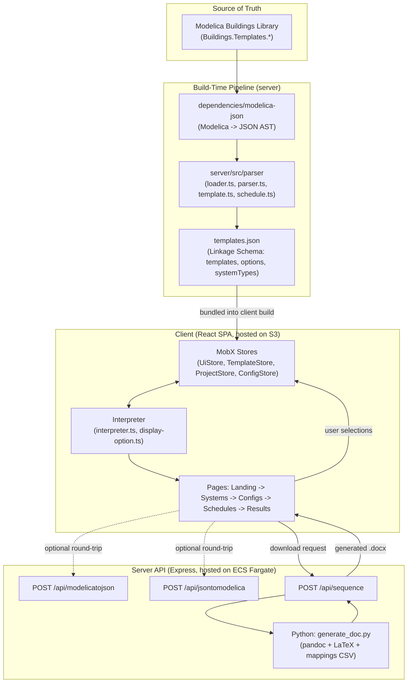
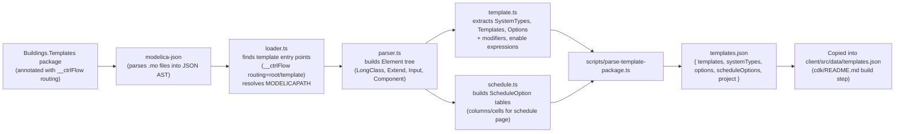
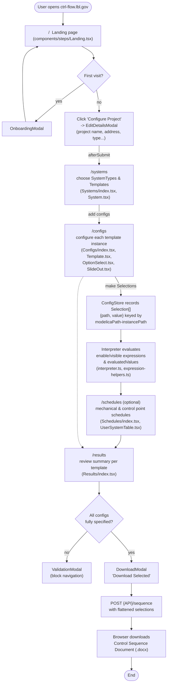
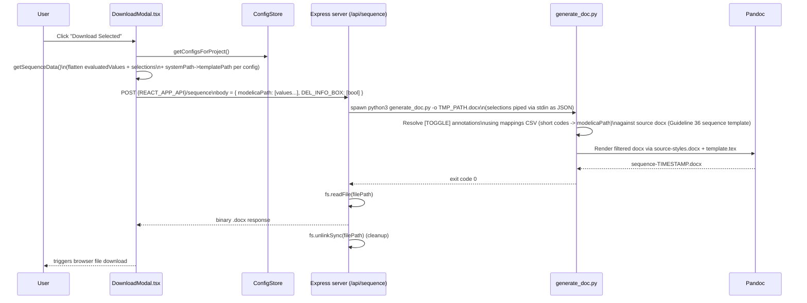
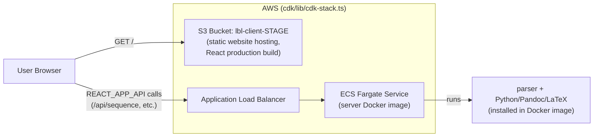

# ctrl-flow Flow Chart

This document visualizes how [ctrl-flow.lbl.gov](https://ctrl-flow.lbl.gov) works end-to-end: from the Modelica
template source, through the build-time parsing pipeline, into the React
front-end user journey, and finally out as a generated Control Sequence
Document. It complements [linkage-schema.md](./linkage-schema.md) (data
shapes) and [sequence-doc.md](./sequence-doc.md) (annotation syntax) with a
process-oriented view.

## 1. High-Level System Architecture

**Key idea:** the Modelica template library is parsed **once at build time**
into a static `templates.json` ("Linkage Schema") that ships with the client.
The browser app then runs entirely client-side against this schema (no
server calls needed to browse templates/options). The server is only called
again when the user wants to **export** a Control Sequence Document.

## 2. Build-Time: Modelica → Linkage Schema (`templates.json`)

- Entry point: `npm run parseTemplateJSON` (`server/scripts/parse-template-package.ts`), which calls
  `loadPackage("Buildings.Templates")` then `getTemplates()/getSystemTypes()/getOptions()/getProject()`
  from `server/src/parser/index.ts`.
- In production deploys, this JSON is generated inside the server Docker
  image and `docker cp`'d into `client/src/data/templates.json` before the
  client is built (see `cdk/README.md`).
- This is the "Linkage Schema" — see `docs/linkage-schema.md` for the full
  type definitions (`SystemType`, `Template`, `Option`, `ScheduleOption`).

## 3. Runtime: User Journey Through the App (client/src/App.jsx)

Persistent state (via `mobx-persist-store`) lives in four MobX stores created in
`client/src/data/index.ts`:

| Store | Responsibility |
|---|---|
| `UiStore` | transient UI state (e.g. `activeTemplate`, active tab) |
| `TemplateStore` | read-only Linkage Schema data (`templates.json`) — templates, options, systemTypes |
| `ProjectStore` | project metadata (name, address, type, size, units, code, notes) |
| `ConfigStore` | user's `Config`/`Selection[]` per template instance — the write-side data |

All stores are namespaced under `localStorage` key `lbl-storage-v<version>` so
a user's in-progress project persists across page reloads.

## 4. Control Sequence Document Generation (Download Flow)

Notes:

- The annotation language (`[EQUALS BSP RELIEFDMPR]`, `[AND ...]`, `[TABLE ...]`,
  etc.) that drives which sections of the sequence document survive is
  documented in `docs/sequence-doc.md`.
- The mapping between short codes used in annotations and full
  `modelicaPath`s is stored in a CSV under
  `server/scripts/sequence-doc/src/version/current/`.
- Related but currently **unused in the UI** endpoints exist for a full
  Modelica round-trip:
  - `POST /api/modelicatojson` — parses raw Modelica text into JSON via `dependencies/modelica-json`.
  - `POST /api/jsontomodelica` — converts JSON back into Modelica text.
  These are exercised by server integration tests and are intended for a
  planned future flow where selections are written back into a `.mo` file
  (see "Planned" section of the sequence diagram in `docs/linkage-schema.md`).

## 5. Deployment Topology (AWS, via CDK)

- `cdk/README.md` documents the manual deploy sequence: CDK provisions the S3
  bucket + Fargate/ALB, the server Docker image is built to extract a fresh
  `templates.json`, then the client is built with `REACT_APP_API` pointing at
  the deployed ALB URL and synced to S3.
- Production and staging both deploy this same topology via GitHub Actions
  (`.github/workflows/prod-deploy.yml`, `staging-deploy.yml`), pointing
  `REACT_APP_API` at `https://ctrl-flow.lbl.gov/api` and
  `https://staging.ctrl-flow.lbl.gov/api` respectively.

## Summary

1. **Offline/Build-time:** Modelica template library → `modelica-json` → LBNL's
   custom parser (`server/src/parser`) → `templates.json` (Linkage Schema).
2. **Client runtime:** React SPA loads the static schema into MobX stores; the
   user walks through Landing → Systems → Configs → (Schedules) → Results,
   with the `interpreter` evaluating conditional visibility/values live in
   the browser — no server round-trip required to browse/configure.
3. **Export:** On download, the client flattens its `Selection`s and POSTs
   them to the Express server's `/api/sequence` endpoint, which shells out to
   a Python script that uses Pandoc/LaTeX plus a mappings CSV to filter the
   ASHRAE Guideline 36 source document down to a project-specific `.docx`
   Control Sequence Document, streamed back to the browser as a download.
4. **Deployment:** Client is a static site on S3; server runs as a Dockerized
   Express app on ECS Fargate behind an ALB — all provisioned via the CDK
   stack in `cdk/lib/cdk-stack.ts`.
