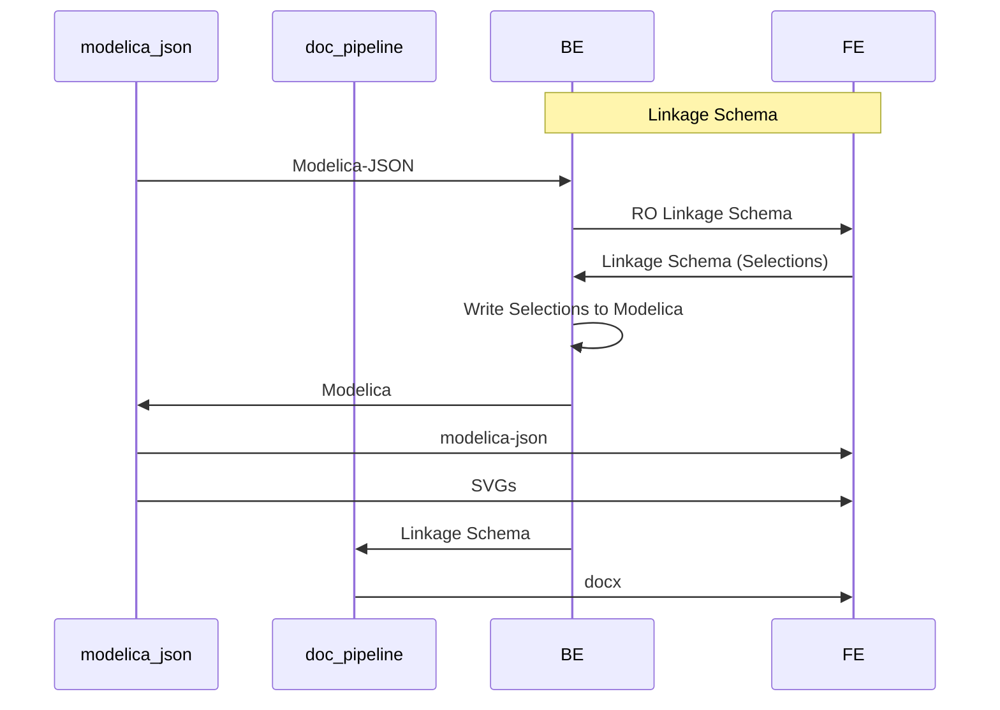

# Linkage Schema

Linkage Schema is the intermediate format extracted by the parser from modelica-json to narrowly capture what is necessary to:

1. Render available selections from a template
2. Record selections to be used to write out a completed template in modelica

## Overview of Data Types

Read-Only Data types (static data extracted from modelica packages)

- `SystemType`: template category
- `Template`: Modelica Template
- `Option`: a node of info from the template that either specifies how to render a dropdown or bit of UI, or links to a list of child options
- `ScheduleOption`: Like an `Option` but it also has `ScheduleCategory` categories
- `ScheduleCategory`: Categories for `ScheduleOption`

Write Data types (data created from user input):

- `Project`: User project that contains configs
- `ProjectDetail`: project meta-data
- `Configuration`: Container for a configuration that includes the template and the list of selections/inputs made
- `Selection`: Each selection made in a template

## Overview of Data-Flow:



## Modelica Paths as UUIDs

The parser extracts portions of a template and uses `modelicaPath`s as a unique identifier for that portion of a template. This is leveraging modelica's path system that uses dot access to indicate where to find a given piece of modelica.

For example, this is the path to a MultizoneVAV template:

`Buildings.Templates.AirHandlersFans.MultizoneVAV`

And a path to a parameter within the MutlizoneVAV template:

`Buildings.Templates.AirHandlersFans.MultizoneVAV.supBlo`

Most of the linkage schema data types use this path (using the keyname `modelicaPath`) as a unique identifier.

## Read-only Types

### SystemTypes

System types are categories for templates.

```typescript
export interface SystemTypeInterface {
  description: string; // user facing string
  modelicaPath: string;
}
```

### Templates

Holds meta info about a given template. Templates have a one to many relationship with SystemTypes.
`modelicaPath`: the UUID for the template, as well as the identifier for the entrypoint option in the options table.

`systemTypes`: this is an in-order hierarchical list of categories. Currently modelica-buildings only has categories one level deep, but we need to support multiple levels.

```typescript
export interface TemplateInterface {
  modelicaPath: string; // unique identifier
  name: string; // user facing string
  systemTypes: string[]; // in-order list of system type modelicaPaths
}
```

### Options

An option represents a 'node' of info from the template that _could_ be rendered into visible UI in the front-end.

`visible`: Options are a modal data structure that can behave in two ways:

1. If `visible` is true, it will be rendered with childOptions rendered in a dropdown list
2. If `visible` is false, attempt to render each childOption.

`type`: a modelica path to a specific type OR a primitive type ('String', 'Number', 'Boolean')
`value`: If a default value is assigned in the template it is represented here. This assignment will have the same type as 'type'.
`valueExpression`: Default values can be assigned by expression (e.g. `if param is > 5 true else false`).
`enable`: An expression to determine whether or not an option is enabled.

NOTE: expression integration is ongoing so `valueExpression` and `enable` are always null. When the parser starts extacting expressions it will do so in a TBD `Expression` format used for both `valueExpression` and `enable`.

```typescript
interface OptionInterface {
  modelicaPath: string;
  type: string;
  name: string;
  value?: string | boolean | null | number;
  group?: string;
  tab?: string;
  visible?: boolean;
  options?: string[];
  childOptions?: OptionInterface[];
  valueExpression?: any; //
  enable?: any; // { modelicaPath: string; expression: string };
}
```

Options have a recursive structure with options having options. To traverse the entire list of options for a given template:

1. Lookup the entrypoint option of a template by finding the option with a matching modelica path
2. For each childOption, visit that option and each of it's childOptions

TODO: there is an open question about separating option groups and single options as a data type.

### Expression - TBD

### Schedule Table reorganization

Inputs for the schedule table are generically extracted in the same option tree used for configurations. The parser needs to be updated to unpack the tree into more convenient format as well as include grouping information for the schedule table.

`ScheduleGroup`:

```typescript
interface ScheduleGroup {
  modelicaPath: string;
  name: string;

```

`ScheduleOption`:

```typescript
interface ScheduleOption extends OptionInterface {
  ScheduleGroups: string[]; // in-order list of schedule groups
}
```

From this example table:

```
                                   |              group1               |
                 |    subgroup1    |    subgroup2    |     subgroup3   |
        |--------|-----------------|--------|--------|-----------------|
        | param1 | param2 | param3 | param4 | param5 | param6 | param7 |
|-------|--------|--------|--------|--------|--------|--------|--------|
| row1  |  val1  |  val2  |  val3  | val4   | val5   | val6   |  val7  |
| row2  |  ...
```

- Each 'val' cell is its own `Option` with a unique modelica path
- Each `Option` can be grouped in an arbitrary number of groups. `val1` is in no groups, `val2` in one ('subgroup1') and `val4` in two ('group1', 'subgroup2'). The `ScheduleGroups` array for `val4` would look as follows: `['group1', 'subgroup2']`

## Write Data - User Configurations

### Project

`Project` contains metadata about a project. The linkage-widget store is setup to handle setting an active project, however UI has not been setup yet to switch the active project.

```typescript
export interface ProjectDetailInterface {
  name: string;
  address: string;
  type: string;
  size: number;
  units: string;
  code: string;
  notes: string;
}

export interface ProjectInterface {
  id: string;
  projectDetails: ProjectDetailInterface;
}
```

### Configurations

Configurations hold all input for a given template.

```typescript
export interface ConfigInterface {
  [key: string]: string | number | undefined | boolean | SelectionInterface[];
  id?: string; // TODO: likely remove, templatePath should be unique
  name?: string; // user facing string
  isLocked?: boolean; // TODO: likely remove
  selections?: SelectionInterface[];
  quantity?: number;
  systemPath: string; // TODO: remove this - info already available in template
  templatePath: string; // modelica path for a given template
}
```

### Selections

Each input in the linkage widget gets captured using a selection.

`name`: the modelica path of an option
`value`: the selection/value

TODO: this data type may need to be expanded to include `type` as `value` will need to hold the following types of input:

- A modelica path for a component/enum selected in a dropdown
- strings
- numbers
- booleans

```typescript
export interface SelectionInterface {
  name: string; // TODO: rename to 'path'
  value: any;
}
```
