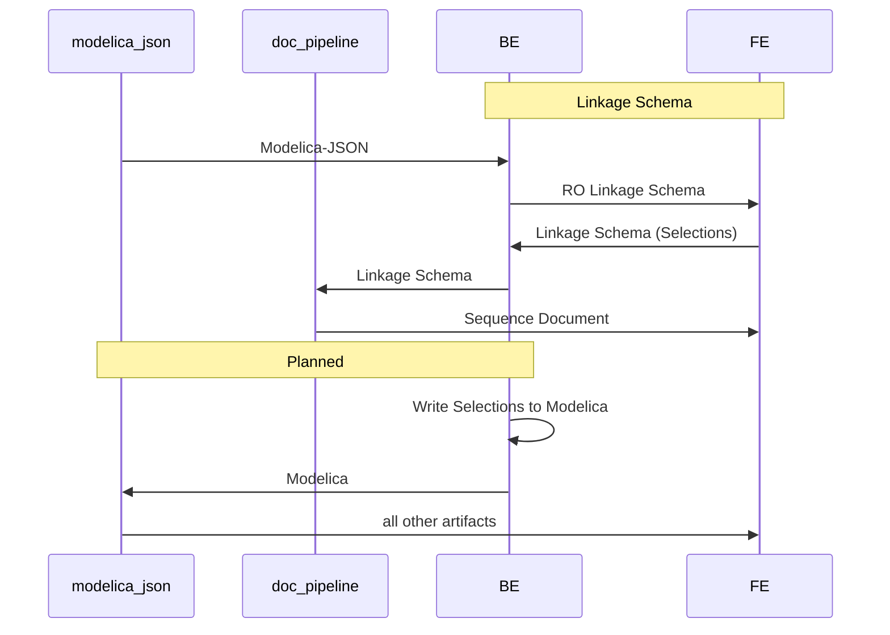

# Linkage Schema

Linkage Schema is the intermediate format extracted by the parser from modelica-json to narrowly capture what is necessary to:

1. Render available input from a template
2. Record input to for use to generate a completed modelica template

## Overview of Data Types

Read-Only Data types (static data extracted from modelica packages)

- `SystemType`: template category
- `Template`: Modelica Template
- `Option`: a node of info from the template that either specifies how to render a dropdown or bit of UI, or links to a list of child `Option`s
- `ScheduleOption`: Like an `Option` but it also has a list of `ScheduleCategory`s
- `ScheduleCategory`: Category for `ScheduleOption`

Write Data types (data created from user input):

- `Project`: User project that contains configs
- `ProjectDetail`: project meta-data
- `Config`: Container for a configuration that includes the template and the list of component selections
- `Selection`: Each selection made/input in a template
- `FullConfig`: A configuration that is fully configured with component configuration (from the config page) and mechanical and control points specified (from the schedule page)

## Overview of Data-Flow:



## Modelica Path

The parser extracts portions of a template and uses `modelicaPath`s as a unique identifier for that portion of a template. This is leveraging modelica's path system that uses dot access to indicate where to find a given piece of modelica.

For example, this is the path to a MultizoneVAV template:

`Buildings.Templates.AirHandlersFans.MultizoneVAV`

And a path to a parameter within the MutlizoneVAV template:

`Buildings.Templates.AirHandlersFans.MultizoneVAV.supBlo`

Most of the linkage schema data types use this path (using the keyname `modelicaPath`) as a unique identifier.

## Read-only Types

### SystemTypes

System types are categories for templates.

```typescript
export interface SystemTypeInterface {
  description: string; // user facing string
  modelicaPath: string;
}
```

### Templates

Holds meta info about a given template. Templates have a one to many relationship with SystemTypes.

`modelicaPath`: the UUID for the template, as well as the identifier for the entrypoint option in the options table.

`systemTypes`: this is an in-order hierarchical list of categories. Currently modelica-buildings only has categories one level deep, but we need to support multiple levels.

`pathModifiers`: Templates have implementations of components that contain `outer` declarations, with the template implementing the `inner` portion. This ends up as a map, mapping from the `outer` path segment to the `inner` path segment.

```typescript
export interface TemplateInterface {
  modelicaPath: string;
  pathModifiers: { [key: string]: string };
  scheduleOptionPaths: string[];
  systemTypes: string[];
  name: string; // Class Description
}
```

For example, `VAVBoxReheat` has the following modifiers:

```json
"pathModifiers": {
  "ctl.damVAV": "damVAV",
  "ctl.coiHea": "coiHea",
  "ctl.datAll": "datAll"
},
```

In an evaluation engine, all path segments that reference `ctl.damVAV` get replaced with `damVAV` when using the `VAVBoxReheat` template.

### Options

An option represents a 'node' of info from the template that _could_ be rendered into visible UI in the front-end.

```
`visible`: if 'true' this option can be rendered depending on the value of 'enable'
`type`: a modelica path to a specific type OR a primitive type ('String', 'Number', 'Boolean')
`value`: the 'value' of an option. What value means depends on the template node (is it a replaceable, a definition, a primitive?)
`enable`: An expression to determine whether or not an option is enabled.
`modifiers`: instance data that can overwrite the values present in an `Option`.
`options`: available selections for a given option OR
`choiceModifiers`: some instance data is only applied if a specific choice is made. Those modifiers are included grouped by the 'choice' path (which )
```

```typescript
export interface OptionInterface {
  modelicaPath: string;
  type: string;
  name: string;
  value?: string | boolean | null | number;
  group?: string;
  tab?: string;
  visible?: boolean;
  options?: string[];
  enable?: Expression;
  modifiers: { [key]: { expression: Expression; final: boolean } };
  choiceModifiers?: { [key: string]: Modifiers };
  definition: boolean;
  replaceable: boolean;
}
```

Options have a recursive structure with each `Option` potentially having child `options`.

This one-to-many relationship creates the tree representing the nodes that make up a template.

### Expressions

```typescript
export type Literal = boolean | string | number;

export type Expression = {
  operator: "<>" | "!=" | "if" | "else" | "if_elseif" | "none";
  operands: Array<Literal | Expression>;
};
```

`Operator`: a string indicating which operation. `none` is a special operator indiciating the operand is a `Literal` that requires no evaluation.
`Operands`: a list that can either be a literal value (like the number `4`) or another expression to resolve

### Schedule Table reorganization

Inputs for the schedule table are generically extracted in the same option tree used for configurations. The parser needs to be updated to unpack the tree into more convenient format as well as include grouping information for the schedule table.

`ScheduleGroup`:

```typescript
interface ScheduleGroup {
  modelicaPath: string;
  name: string;

```

`ScheduleOption`:

```typescript
interface ScheduleOption extends OptionInterface {
  ScheduleGroups: string[]; // in-order list of schedule groups
}
```

From this example table:

```
                                   |              group1               |
                 |    subgroup1    |    subgroup2    |     subgroup3   |
        |--------|-----------------|--------|--------|-----------------|
        | param1 | param2 | param3 | param4 | param5 | param6 | param7 |
|-------|--------|--------|--------|--------|--------|--------|--------|
| row1  |  val1  |  val2  |  val3  | val4   | val5   | val6   |  val7  |
| row2  |  ...
```

- Each 'val' cell is its own `Option` with a unique modelica path
- Each `Option` can be grouped in an arbitrary number of groups. `val1` is in no groups, `val2` in one ('subgroup1') and `val4` in two ('group1', 'subgroup2'). The `ScheduleGroups` array for `val4` would look as follows: `['group1', 'subgroup2']`

## Write Data - User Configurations

### Project

`Project` contains metadata about a project

```typescript
export interface ProjectDetailInterface {
  name: string;
  address: string;
  type: string;
  size: number;
  units: string;
  code: string;
  notes: string;
}

export interface ProjectInterface {
  id: string;
  projectDetails: ProjectDetailInterface;
}
```

### Configurations

Configurations hold all input for a given template.

```typescript
export interface Config {
  [key: string]: string | number | undefined | boolean | SelectionInterface[];
  id: string;
  name?: string; // user facing string
  isLocked?: boolean; // TODO: likely remove
  selections?: SelectionInterface[];
  quantity?: number;
  systemPath: string; // TODO: remove this - info already available in template
  templatePath: string; // modelica path for a given template
}
```

### Selections

```typescript
export interface Selection {
  path: string;
  value: any;
}
```

When a user makes a selection related to a component in `ctrl-flow`, (e.g., when selecting 'Fan array'for a component of the Multi-zone ) the following key-value pair is created:

```json
{
  "Buildings.Templates.AirHandlersFans.Components.OutdoorReliefReturnSection.MixedAirWithDamper.secOut-secOutRel.secOut": "Buildings.Templates.AirHandlersFans.Components.OutdoorSection.DedicatedDampersPressure"
}
```

The 'key' is composed of two parts, a modelica path and an instance path. The 'value' of the component is a modelica path.

```
modelicaPath: Buildings.Templates.AirHandlersFans.Components.OutdoorReliefReturnSection.MixedAirWithDamper.secOut
instancePath: secOutRel.secOut

value: "Buildings.Templates.AirHandlersFans.Components.OutdoorSection.DedicatedDampersPressure"
```

The instance path is required as components can be re-used within the same template.
